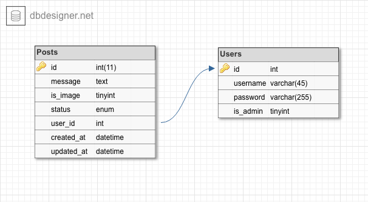

## Guestbook Code Challenge

#### Prerequisites

Please install [Docker](https://www.docker.com/get-started) on your machine

#### Installation
Download the project into a folder, and then go into the folder.
Create ``.env`` file from ``.env.dist``.

Inside the project you can find ``Makefile`` that allows you to run console commands
Type in the console window:

    make dev
    
This command will run docker-compose and after images are build and running, 
it will executed composer install.
If you would like to access the php container that contains the code, you can type

    make console
    
Now if all containers are build successfully, you can type in the browser:
    
    http://localhost:8080/

    
#### Description
For base infrastructure I have used docker platform, and 
configured 3 service: nginx, php and mysql inside docker-composer yml file.
To be able to use environment variables I have used a dotenv library.

To build PHP architecture, I have used next solutions:

##### Container
To provide autowiring and initialize the classes required to handle the request.
Autowiring is created based in Reflection classes.

##### Router
Has configuration that defines what controller will handle a request, based on URL pattern
and request method. Initialized in  src/Container/Configuration.php

##### Controller
Responsible to transfer request data into services and to return response

##### Service
Services are responsible for business logic

##### Repository
Repositories prepare queries for Storage Adapters according to business rules

##### Storage Adapter
Adapters build queries to find or save data into the storage

##### Views
I have created html templates using heredoc. Not the best solution, but I have created 
the fastest one. I would like to use an Template engine, like Twig, but as I understood
I am not allowed to use any library.
    
#### Database
Database Network access is under ``localhost:33061``
User Credentials are: ``username`` and ``password``
Database Name is ``guestbook``
The dump file can be found in ``./resources/volumes/mysql/guestbook.sql``  

The database consist of 2 tables: ``users`` and ``posts``. 
``Posts`` contain the information about the post and also there is a column that
makes relation to ``users`` table, using foreign key.

#### Unit Test
Some unit tests have been created. More will follow.

#### UML Diagram

#### TODOs:

- I want to created a table with roles, to provide more flexibility to role management.
- Add sharable instances of a class in the container
- Improve autowiring, and put configuration into an yaml file instead of direct php definition
- Separate Validation component instead of validating the values in the services
- User Friendly error display on form submit failures
- Full Unit Test Coverage & Some Integration Tests for main functionality
- Use an Template Engine, like Twig to manage templates 
  

